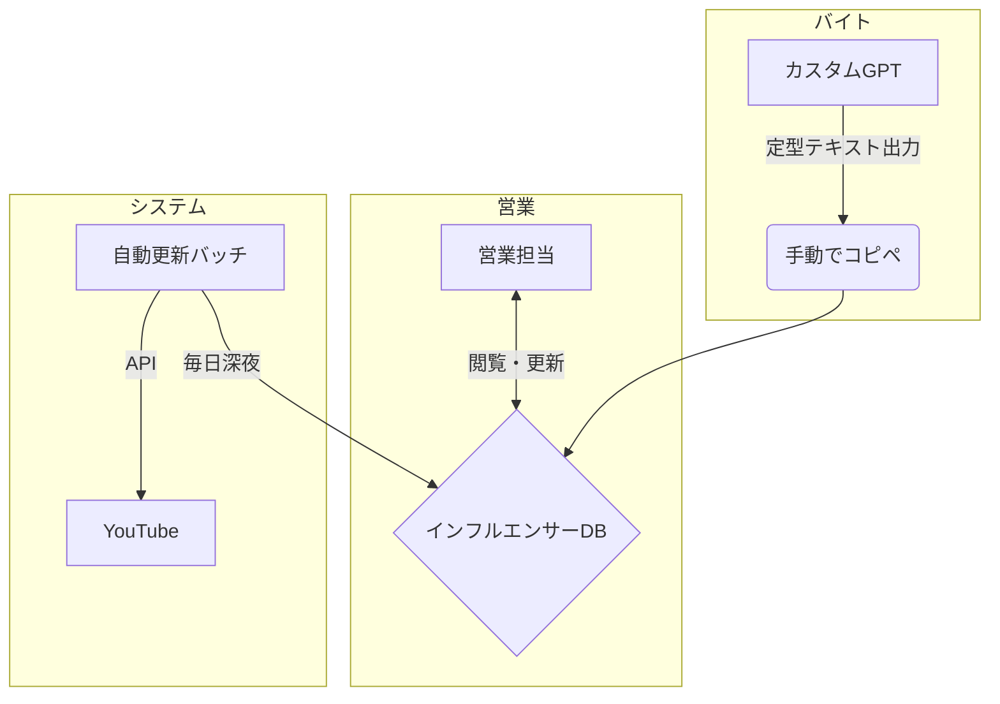

# Orizum様向け インフルエンサーDB運用効率化プロジェクト ご提案資料

**作成日:** 2026年1月20日

---

## 本日のアジェンダ

1.  **現状の課題とプロジェクトの目的**
2.  **全体像とロードマップ：どうやって実現するのか**
3.  **登場人物別の1日の流れ（新しい働き方）**
4.  **Phase 2：Webアプリの世界観（画面イメージ）**
5.  **成功の測り方（KPI）**
6.  **次のステップ**

---

## 1. 現状の課題とプロジェクトの目的

### 現状の課題

-   **情報の属人化と入力負荷:** バイトによる情報追加のフォーマットが非統一で、備考欄に重要な情報が混在。
-   **営業活動の非効率:** スプレッドシートからアプローチ対象を探すのに時間がかかり、追いDMのタイミング管理も難しい。
-   **データの陳腐化:** 一度登録したインフルエンサーの登録者数などが古くなり、データとしての価値が低下。

### 本プロジェクトが目指すゴール

これらの課題を解決し、**「営業担当者が、迷わず、最速で、最も効果的なアプローチを継続できる仕組み」**を構築します。

--- 

## 2. 全体像とロードマップ

価値を最速で提供しながら、段階的に理想形へと進化させる3フェーズの計画をご提案します。

### システムの全体像

（ここに `system_specification.md` にあるMermaid図を挿入）



### ロードマップ

| フェーズ | 名称 | 主なゴール | 提供価値 |
| :--- | :--- | :--- | :--- |
| **Phase 0** | **スプシ運用を固める** | 現行スプシを改善し、営業が効率的に回せる状態を即時実現する。 | **「追い漏れ」と「検索の迷い」がゼロになる** |
| **Phase 1** | **YouTube自動更新** | DBのデータ鮮度を自動で維持する。 | **常に最新の登録者数を見てアプローチ判断ができる** |
| **Phase 2** | **Webアプリ化** | 圧倒的な検索性と視認性で、営業活動をさらに加速させる。 | **「探す・考える」時間を最小化し、アプローチに集中できる** |

---

## 3. 登場人物別の1日の流れ（新しい働き方）

### バイトの1日：高速・高精度なデータ入力

1.  **カスタムGPTに指示:** 「ゲーム実況、登録者10万人以上」など、探したい条件をGPTに投げる。
2.  **定型リストをコピー:** GPTが出力した、フォーマットが統一されたインフルエンサーリストをコピーする。
3.  **スプシにペースト:** スプレッドシートの新しい行にそのまま貼り付けて、作業完了。

> **→ これにより、手作業での整形や項目漏れがなくなり、DBの品質と登録スピードが向上します。**

### 営業の1日：もう「誰に送るか」で迷わない

1.  **スプシを開く:** 最初に「**③ 返信ありリスト**」を確認し、温度感の高い相手に即時対応。
2.  **次に「② 追いDM対象リスト」を確認:** 今日が追いDM送信日になっている候補者に、上から順にアプローチ。
3.  **最後に「① 未DMリスト」を確認:** 新しく追加された候補者に、初回DMを送信。

> **→ 営業担当は、毎日この3つのビューを見るだけで、対応すべき全てのインフルエンサーを網羅できます。**

### システムの1日：人知れずDBの価値を守る

1.  **深夜に自動起動:** 営業担当が寝ている間に、システムが自動で動き出します。
2.  **全件チェック:** DBにある全てのYouTubeチャンネル情報をチェック。
3.  **データを最新化:** 登録者数などの最新情報を取得し、スプレッドシートを更新。
4.  **結果を記録:** 更新に成功したか、失敗したか（理由も）を記録し、朝には最新の状態が完成。

> **→ これにより、DBは「生きている資産」となり、その価値を維持・向上させ続けます。**

---

## 4. Phase 2：Webアプリの世界観（画面イメージ）

スプレッドシート運用で基盤を固めた後、最終形であるWebアプリへと移行します。

### ① ダッシュボード：あなたの「今日のToDoリスト」

ログインすると、あなたが今日対応すべき「未DM」「追い対象」「返信あり」の件数とリストが自動で表示されます。

```
+----------------------------------------------------+
| ダッシュボード (担当：山田)                        |
+----------------------------------------------------+
|                                                    |
| [未DM: 15件]  [追い対象: 8件]  [返信あり: 2件]     |
|                                                    |
| ▼ 追い対象リスト (8件)                             |
|   - 〇〇チャンネル (追い1 / 期限超過2日)           |
|   - △△ゲームズ (追い2 / 本日期限)                  |
|   ...                                              |
+----------------------------------------------------+
```

### ② 詳細画面：全ての情報をこの1枚に集約

インフルエンサー名をクリックすると、判断に必要な全ての情報が1画面に表示されます。

```
+------------------------------------------------------------------------------------+
| 〇〇チャンネル (登録者: 15.2万人) - ステータス: 追いDM1済                          |
+------------------------------------------------------------------------------------+
| [基本情報] [接触履歴] [DM提案]                                                     |
+------------------------------------------------------------------------------------+
|                                                                                    |
| ▼ AIによるDM提案 (追いDM)                                                          |
|                                                                                    |
|   案1: シンプルに再打診                                                            |
|     「先日は〇〇の件でご連絡いたしましたが、その後いかがでしょうか…」              |
|                                                                                    |
|   案2: 最近の動画に言及                                                            |
|     「最新の〇〇の動画、大変楽しく拝見しました！特に〇〇の点が…」                  |
|     (根拠: 最新動画のタイトルと内容をAIが分析)                                     |
|                                                                                    |
+------------------------------------------------------------------------------------+
```

> **→ これにより、複数タブや別資料を見に行く必要がなくなり、AIの提案を参考にしながら、迅速に次のアクションを決定できます。**

---

## 5. 成功の測り方（KPI）

このプロジェクトの成功は、以下の指標で測定します。

| KPI | 目標値（月間） | これが達成されるとどうなるか？ |
| :--- | :--- | :--- |
| **新規追加インフルエンサー数** | **300件** | アプローチできる母集団が安定的に増え続ける。 |
| **DM送信数** | **300件** | 営業担当者が効率的にアプローチできている証拠。 |
| **返信率** | **10%** | アプローチの質が向上し、商談化の機会が増える。 |
| **追い漏れ件数** | **0件** | 取りこぼしがなくなり、機会損失がなくなる。 |

---

## 6. 次のステップ

1.  **Phase 0の開始:** 本日ご提案した新しいフォーマットでスプレッドシートのテンプレートを準備し、すぐに運用を開始します。
2.  **カスタムGPTプロンプトの連携:** 共有いただいたGPTの出力が、新フォーマットに沿っているか最終確認・調整を行います。
3.  **Phase 1の開発着手:** スプシ運用と並行して、YouTube自動更新機能の開発に着手します。
